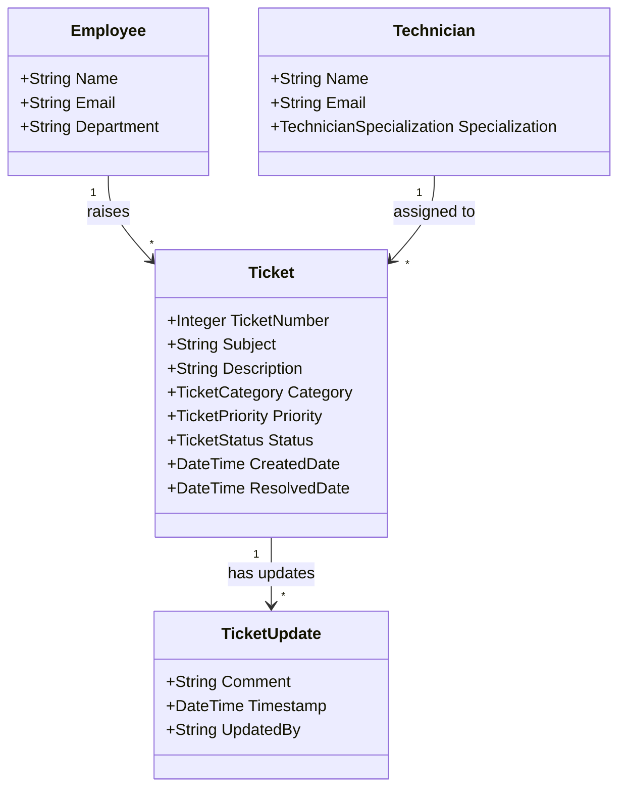
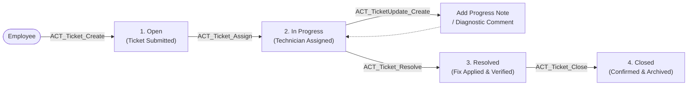

# 🎫 QuickFix Ticketing System

> **A Low-Code Enterprise IT & Facility Support Management Application**  
> *Built with Mendix Low-Code Application Platform*  
> **Author:** Aravind (Easwari Engineering College)
> > **Note:** This project was developed as part of the **Siemens Industry Readiness Program** and is shared publicly as a personal portfolio project with permission. It is not an official Siemens product or endorsement.

[](https://www.mendix.com/)
[]()
[]()
[](LICENSE)

---

## 📌 Overview

In modern workplaces, employees frequently report IT hardware faults, software defects, network glitches, and facility issues informally through email threads, instant messaging, or in-person verbal requests. This ad-hoc approach leads to lost tickets, lack of accountability, delayed resolutions, and zero audit trails.

**QuickFix Ticketing System** is a centralized low-code enterprise web application built on **Mendix**. It streamlines the entire issue resolution lifecycle—from ticket intake and technician assignment to status updates, resolution verification, and ticket closure.

---

## 🏗️ System Architecture & Domain Model

The application leverages Mendix's visual domain modeling and relational persistence layer, linking support tickets with employees, assigned technicians, and sequential update logs.



---

## 🔄 Ticket Lifecycle & Microflow Engine

Every support request transitions through a defined, auditable state machine powered by Mendix microflows:



### Core Business Logic Microflows:
- **`ACT_Ticket_Create`**: Validates input data, generates sequential ticket IDs, timestamps initial creation, sets status to `Open`, and links to the raising employee.
- **`ACT_Ticket_Assign`**: Allocates the ticket to an available technician based on domain specialization and updates status to `In Progress`.
- **`ACT_Ticket_Resolve`**: Sets resolution timestamp, records diagnostic actions taken, and advances status to `Resolved`.
- **`ACT_Ticket_Close`**: Completes user confirmation, locks ticket edits, and transitions status to `Closed`.
- **`ACT_TicketUpdate_Create`**: Adds threaded commentary and progress notes to preserve a complete audit trail.

---

## 👥 Role-Based Views & Key Pages

| Interface | Target Role | Key Features |
| :--- | :--- | :--- |
| **New Ticket Form** | Employee | Structured submission form with subject, description, category selection, and priority tagging |
| **My Tickets** | Employee | Personalized dashboard displaying all tickets raised by the employee with live status indicators |
| **All Tickets Worklist** | Technician / Admin | Comprehensive filterable data grid to view, triage, sort, and claim open requests |
| **Ticket Details** | Technician / Employee | Consolidated view containing full ticket history, technician assignments, update comments, and status action buttons |

---

## 📁 Repository Structure

```text
├── QuickFix.mpr                     # Main Mendix Project Package (Project Model & Layout)
├── QuickFix_Ticketing_System.pptx   # Architectural overview & presentation deck
├── javasource/                      # Generated Java proxy classes and custom microflow bindings
│   └── myfirstmodule/               # Core business module (Domain entities, microflows, enums)
├── themesource/                     # Atlas UI styling, layout templates, and SCSS modules
├── resources/                       # Static assets and runtime configurations
├── .gitignore                       # Mendix-specific exclusion rules (deployment artifacts, cache)
├── LICENSE                          # MIT Open Source License
└── README.md                        # Project documentation and architectural guide
```

---

## 🚀 Getting Started with Mendix Studio Pro

### Prerequisites
- **Mendix Studio Pro** (version 10.x or compatible)
- **Java Development Kit (JDK 17)**

### How to Open & Run:
1. **Clone the Repository:**
   ```bash
   git clone https://github.com/aravindm30112006/QuickFix-Ticketing-System.git
   cd QuickFix-Ticketing-System
   ```
2. **Open in Mendix Studio Pro:**
   - Launch Mendix Studio Pro.
   - Click **Open App** and select `QuickFix.mpr`.
3. **Run Locally:**
   - Press **F5** (or click **Run Locally** in the top navigation bar).
   - Once deployment completes, click **View App** to launch the web client in your browser.

---

## 🔮 Roadmap & Future Enhancements

- **Automated Escalation:** SLA breach tracking with countdown timers for critical priority incidents.
- **Notification Services:** Automated email/SMS alerts to ticket owners on status changes.
- **Analytics Dashboard:** Metrics on mean time to resolution (MTTR), ticket volume by category, and technician load balancing.
- **Self-Service Knowledge Base:** Suggested solution articles displayed during ticket creation to deflect common requests.

---

## 📄 License & Attribution

This project is licensed under the [MIT License](LICENSE).

> **Note:** This project was developed as part of the **Siemens Industry Readiness Program (SIRP)** and is shared publicly as a personal portfolio project with permission. It is not an official Siemens product or endorsement.
